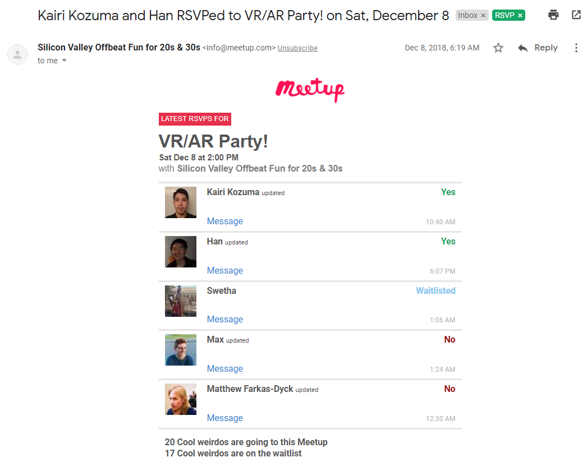
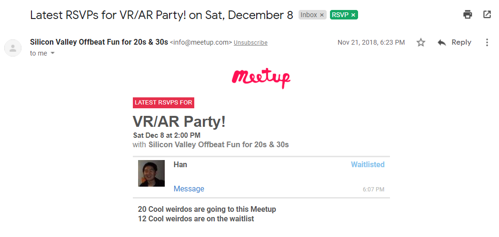
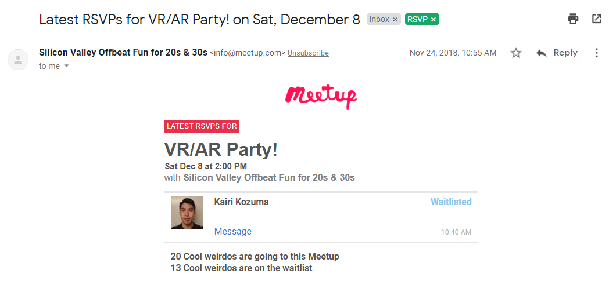

# Details about RSVP emails

Each email from Meetup contains one or more rows. Each row contains this information about an RSVP:

* The user's name
* Whether the RSVP is **yes**, **no**, or **waitlist**
* Whether the user **updated** their RSVP, or RSVPd for the first time to an event
* A timestamp

<!--
### Waitlist mechanics

* Events which have a limited number of guests have a waitlist.
* When the slots are full, guests who are not currently rsvpd yes can only rsvp no or waitlist.
* Guests on the waitlist can change their rsvp to no.
* Guests rsvpd yes can change their rsvp to no.
* As soon as a slot opens and there are people on the waitlist, it is automatically and immediately filled from the waitlist.
-->

The emails have `Content-Type: multipart/alternative`. There are two parts, one with MIME type  `text/plain` and one with type `text/html`. Gmail renders the HTML version. To see the plaintext version, use the ["Show original" menu item](https://support.google.com/mail/answer/29436?hl=en).


Here is a screenshot of an RSVP email. Note the email was sent on December 8th.



And here's the important part of the plaintext version:

<!-- 
https://mail.google.com/mail/u/0/?zx=vis93knbpjz1#inbox/FMfcgxvzMBjPjtSvHmmvKKWzWTnTWjfl
-->

```
Nov 24, 10:40 AM
Kairi Kozuma updated their RSVP to Yes

Nov 21, 6:07 PM
Han updated their RSVP to Yes

Dec 8, 1:06 AM
Swetha was added to the Waitlist

Dec 8, 1:24 AM
Max updated their RSVP to No

Dec 8, 12:30 AM
Matthew Farkas-Dyck updated their RSVP to No
```

*You may notice* the timestamps for Kairi and Han's RSVPs are *two weeks* before the date the email was sent.	

So, let's go back to when Han first RSVPd. The email is from November 21st.

<!--
https://mail.google.com/mail/u/0/?zx=vis93knbpjz1#inbox/FMfcgxvzLhkmPHSJTNWNzQsRBrBFlkDv
-->



```
Nov 21, 6:07 PM
Han was added to the Waitlist

```

And back to when Kairi first RSVPd. The email is from November 24th.

<!--
https://mail.google.com/mail/u/0/?zx=vis93knbpjz1#inbox/FMfcgxvzLrCkCmhdKwSnnCxgzHWlgcJL
-->



```
Nov 24, 10:40 AM
Kairi Kozuma was added to the Waitlist
```